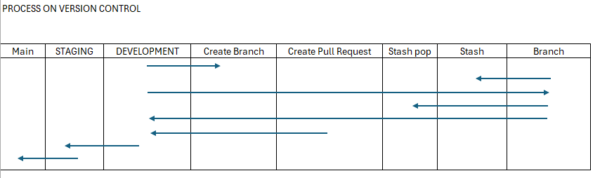

# 🌐 SAWO React Frontend

A modern **React.js** frontend built using **Create React App**, styled with **Tailwind CSS**, and integrated with **Express.js** and **Node.js** for a seamless full-stack workflow.

This project follows **GitHub Flow**, ensuring clean and collaborative development.

---

## 🛠️ Tech Stack


---

## 🚀 Getting Started with Create React App

This project was bootstrapped with [Create React App](https://github.com/facebook/create-react-app).

---

## 📜 Available Scripts

In the project directory, you can run:

### `npm start`

Runs the app in development mode.  
Open [http://localhost:3000](http://localhost:3000) to view it in your browser.

The page will reload when you make changes, and you may also see any lint errors in the console.

### `npm test`

Launches the test runner in interactive watch mode.  
See the section about [running tests](https://facebook.github.io/create-react-app/docs/running-tests).

### `npm run build`

Builds the app for production to the `build` folder.  
It correctly bundles React in production mode and optimizes performance.

The build is minified and filenames include hashes.  
Your app is ready to be deployed!

Learn more about [deployment](https://facebook.github.io/create-react-app/docs/deployment).

### `npm run eject`

> **Note:** This is a one-way operation. Once you `eject`, you can’t go back!

This will copy all configuration files (webpack, Babel, ESLint, etc.) into your project so you can fully customize them.

---

## 📚 Learn More

Learn more from the official documentation:

- [Create React App](https://facebook.github.io/create-react-app/docs/getting-started)
- [React Documentation](https://reactjs.org/)

---

## ⚙️ Advanced Topics

- [Code Splitting](https://facebook.github.io/create-react-app/docs/code-splitting)
- [Analyzing the Bundle Size](https://facebook.github.io/create-react-app/docs/analyzing-the-bundle-size)
- [Making a Progressive Web App](https://facebook.github.io/create-react-app/docs/making-a-progressive-web-app)
- [Advanced Configuration](https://facebook.github.io/create-react-app/docs/advanced-configuration)
- [Deployment](https://facebook.github.io/create-react-app/docs/deployment)
- [Troubleshooting Build Errors](https://facebook.github.io/create-react-app/docs/troubleshooting#npm-run-build-fails-to-minify)

---

## 🧭 Git Workflow

### 🔄 GitHub Flow



### 🧰 Common Git Commands

```bash
# Create and switch to a new branch
git checkout -b <branch-name>

# Push branch to remote
git push -u origin <branch-name>

# Fetch updates from remote
git fetch

# Switch to development branch
git checkout development

# Check status of changes
git status

# Stage all changes
git add .

# Commit changes
git commit -m "Your commit message"

# Push to remote
git push


⚛️ React Learning Guide
1. Core Concepts

JSX – JavaScript syntax extension

Components – Functional & Class components

Props & State – Passing data and managing local state

Event Handling – Handling user input and interactions

2. Intermediate React
🔹 Hooks

useState, useEffect, useContext

Custom hooks

🔹 Component Composition

Children props

Render props

Higher-order components (HOC)

🔹 Context API

Global state management without Redux

🔹 Forms

Controlled vs uncontrolled components

Libraries: Formik, React Hook Form

🔹 Routing

React Router (v6+)

🔹 Data Fetching

Fetch API, Axios, SWR, React Query

3. Advanced React
⚡ Performance Optimization

React.memo, useMemo, useCallback

Code splitting & lazy loading (React.lazy, Suspense)

Error Boundaries

🧪 Testing

Jest & React Testing Library

💻 TypeScript Integration

Strong typing for better scalability

🧠 State Management

Redux Toolkit

Zustand

Recoil

Jotai

MobX

🌐 SSR & SSG

Next.js framework for hybrid rendering

🧩 Additional Topics

Custom hooks & reusable components

Accessibility (a11y)

Animations (Framer Motion, React Spring)

4. Best Practices & Patterns

Scalable folder structure

Avoid prop drilling — use Context or state libraries

Lazy loading for performance

Secure environment variables

Consistent linting & formatting

5. Ecosystem & Tooling

Linting: ESLint

Formatting: Prettier

DevTools: React DevTools, Redux DevTools

Deployment: Vercel, Netlify, AWS, Render

6. Project Ideas

Dashboard with authentication

E-commerce frontend

Blog with markdown support

Real-time chat app (WebSockets)

Integration with REST APIs or GraphQL

🤝 Contributing

Contributions are welcome!
Please follow the Git workflow outlined above and submit a pull request.

🧾 License

This project is licensed under the MIT License.
See the LICENSE
 file for details.

👨‍💻 Author

Developed by: Arniel Montero
             Junnil Jay Estillore
             Edgar De gracia
             Rafael Boroy
Frontend development: React + TailwindCSS
Backend integration: Node.js + Express
Version control: GitHub Flow

"Clean code and consistent workflow are the foundation of every great product."
— SAWO Web Dev


```
carpenters